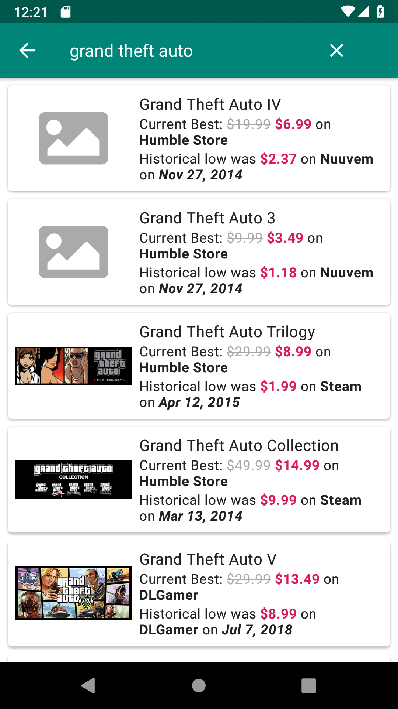
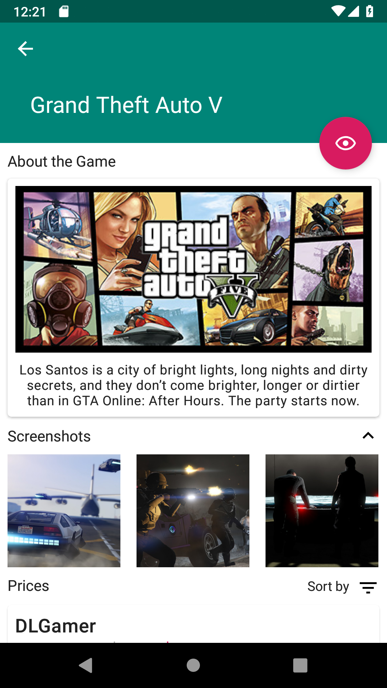
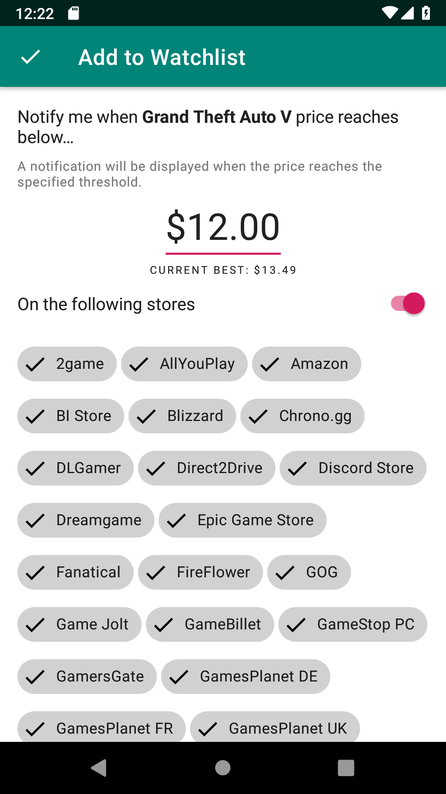

# GameDealz

GameDealz is a **non-official** client for [IsThereAnyDeal.com](https://isthereanydeal.com/), it uses its [API](https://itad.docs.apiary.io/#) 
to retrieve/search for deals and compare prices.

**Disclaimer**: GameDealz is not affiliated in any way with [IsThereAnyDeal.com](https://isthereanydeal.com/).

## Screenshots

## Features 

* List current on going deals according to shops and regions.
* Compare prices and historical lows across different shops.
* Supports searching for games.
* Retrieves from Steam API information such as screenshots and game information.
* Add games to your Watchlist and get notified when there prices reach the specified threshold.
* Has a Dark theme.

## Upcoming/Planned Features

* Add login support for IsThereAnyDeal.com account.
* Sync waitlists and display notification when a better deal pops-up to a waited game.

## Limitations

* Only images for games that are sold on Steam can be displayed, images for shop exclusive games (such as Origin) are not.

* Images for packages and bundles on Steam are not displayed due to limitations from their APIs not exposing such information.

## Contributions

Whether you have ideas, design changes, code cleaning, or real heavy code changes, help is always welcome.

## License

GameDealz is a Free Software: You can use, study share and improve it at your
will. Specifically you can redistribute and/or modify it under the terms of the
[GNU General Public License](https://www.gnu.org/licenses/gpl.html) as
published by the Free Software Foundation, either version 3 of the License, or
(at your option) any later version.  
